# Architecture Document — SEHA Hunting-License Medical Reports System

**Document status:** Living document · **Audience:** Architects, senior engineers, reviewers
**Scope:** Full system (web frontend + REST backend + data tier + delivery pipeline)

---

## 1. Executive Summary

The system issues, audits, and prints **medical fitness reports required for hunting
licenses** on the SEHA health platform. It comprises a **React single-page application
(SPA)** for clinicians and auditors, and an **ASP.NET Core (.NET 10) REST API** backed by
**PostgreSQL**. Three roles drive the workflow: **Doctor** (create / edit / submit),
**Auditor** (approve / return), and **Admin** (read-only oversight).

The frontend is fully RTL/Arabic, styled with a Carbon-inspired design system. The backend
exposes a JWT-secured, OpenAPI-documented API with a clean domain layer, EF Core persistence
(JSON/`jsonb` value objects), and a test strategy combining unit tests with **Testcontainers**
integration tests against a real ephemeral PostgreSQL.

> **Current state (important for review):** The frontend currently persists to browser
> `localStorage` (mock data) and is deployed as a static SPA. The backend is fully authored
> but **not yet wired to the frontend**, and has not been compiled in the authoring sandbox
> (no .NET SDK / offline). Package versions are pinned to plausible `10.x` values and may need
> minor adjustment against the target feed. These caveats are tracked in §22.

---

## 2. Purpose, Scope & Stakeholders

### 2.1 Purpose
Provide a standardized, auditable, paperless process for producing legally-meaningful medical
fitness determinations for hunting-license applicants.

### 2.2 In scope
- Applicant intake, vitals, structured medical exam items, and a fitness determination.
- A two-step clinical workflow (authoring → auditing) with an immutable action log.
- Role-based access control; printable A4 report.

### 2.3 Out of scope (current phase)
- Integration with the Ministry of Environment / national hunting-license registry.
- National Single Sign-On (Nafath) — represented as a decorative button only.
- Payments, scheduling, notifications, document attachments.

### 2.4 Stakeholders & roles

| Role | Responsibilities | Key permissions |
| --- | --- | --- |
| Doctor | Author and submit reports | create, edit (draft/returned), submit, delete (draft) |
| Auditor | Review submitted reports | approve, return-with-note |
| Admin | Oversight / reporting | read-only |

---

## 3. Architectural Goals & Quality Attributes

| Quality attribute | Target / approach |
| --- | --- |
| **Security** | JWT auth, RBAC enforced server-side, PBKDF2 password hashing, least-privilege endpoints |
| **Auditability** | Append-only `Timeline` per report; status transitions are explicit and logged |
| **Testability** | Pure domain logic isolated from I/O; unit + Testcontainers integration tests; coverage gates |
| **Maintainability** | Vertical-slice features, single design system, typed contracts end-to-end |
| **Portability** | Stateless API + containerizable; static SPA deployable to any CDN/host |
| **Internationalization** | First-class RTL/Arabic; locale-aware formatting; LTR isolation for numerals/codes |
| **Performance** | SPA with code-splitting; stateless API horizontally scalable; indexed unique keys |
| **Observability** | Auto-injected Elastic APM at the image layer; health endpoint; structured logs |

---

## 4. Constraints & Assumptions

- **Pipeline compliance:** The enterprise build pipeline mandates .NET 10 (`net10.yaml`),
  Node 22, ≥20% test coverage (rising to 60%), OpenAPI validation, Testcontainers, and
  auto-injected Elastic APM. The architecture satisfies each (see §17).
- **Database standard:** The enterprise "Database Standards" document was encrypted and could
  not be read; **PostgreSQL** was selected as a documented assumption (strong Testcontainers
  support, open standard). This is an explicit risk if the standard mandates another engine.
- **Statelessness:** The API holds no session state; all state is in PostgreSQL. JWTs are
  bearer tokens validated per request.
- **Single bounded context:** "Hunting Medical Reports" is the only context; the design leaves
  room for additional SEHA services (see the services catalog screen).

---

## 5. System Context (C4 — Level 1)

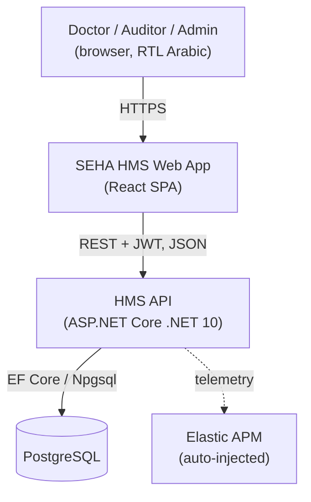

The system is a self-contained product with no external runtime dependencies in the current
phase besides the database and the observability backplane.

---

## 6. Container View (C4 — Level 2)

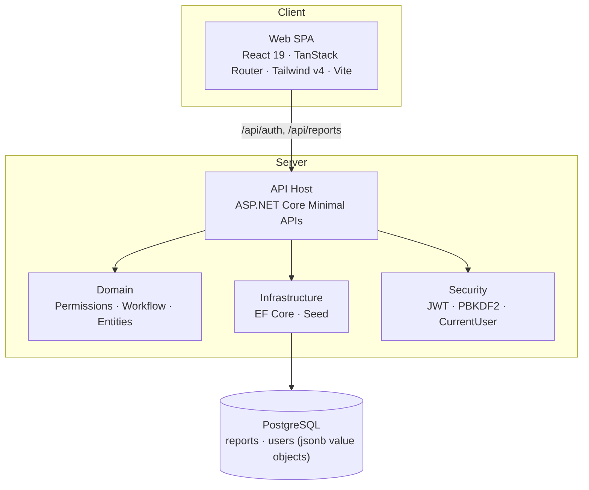

| Container | Responsibility | Tech |
| --- | --- | --- |
| Web SPA | UI, client-side routing, RBAC affordances, printing | React 19, TanStack Router, Tailwind v4, Vite |
| API Host | HTTP endpoints, auth, validation, orchestration | ASP.NET Core (.NET 10) Minimal APIs |
| Domain | Business rules (permissions, workflow), entities | Pure C# (no I/O) |
| Infrastructure | Persistence, seeding | EF Core 10, Npgsql |
| Security | Token issuance/validation, hashing, claims | JWT, PBKDF2-SHA256 |
| Database | Durable storage | PostgreSQL (jsonb for composite value objects) |

---

## 7. Technology Stack & Rationale

| Concern | Choice | Rationale |
| --- | --- | --- |
| UI framework | React 19 + TypeScript | Mature ecosystem, type-safe, team familiarity |
| Routing | TanStack Router (file-based) | Type-safe routes, loaders, `beforeLoad` guards |
| Styling | Tailwind v4 + design tokens | Fast, consistent Carbon-style system; RTL-friendly logical utilities |
| Build | Vite 7 | Fast dev/HMR, simple static output |
| FE tests | Vitest + v8 coverage | Same-language tests, fast, native ESM |
| API | ASP.NET Core .NET 10 Minimal APIs | Mandated LTS; low-ceremony endpoints |
| ORM | EF Core 10 + Npgsql | Productive, `jsonb` owned types, migrations |
| AuthN | JWT Bearer | Stateless, standard, SPA-friendly |
| API docs | OpenAPI 3.1 (built-in + `openapi.yaml`) | Pipeline requirement; contract-first option |
| BE tests | xUnit + Coverlet + Testcontainers | Real-infra integration tests, coverage gates |
| DB | PostgreSQL | Testcontainers support; open standard (assumption) |

---

## 8. Repository Structure

```text
.
├── src/                         # Frontend (React SPA)
│   ├── main.tsx                 # Client entry (RouterProvider)
│   ├── router.tsx               # Router factory (getRouter)
│   ├── routeTree.gen.ts         # Generated route tree (TanStack plugin)
│   ├── routes/                  # File-based routes
│   │   ├── __root.tsx           # Root layout (Outlet + Toaster)
│   │   ├── index.tsx            # Redirect (auth-aware)
│   │   ├── login.tsx · otp.tsx  # Authentication screens
│   │   └── _app/                # Authenticated layout (Shell) + pages
│   │       ├── dashboard.tsx · services.tsx
│   │       └── hunting-medical/ # List, new, $id (view), edit, audit, print
│   ├── components/hms/          # Design-system + domain components
│   ├── components/ui/           # shadcn/ui primitives
│   ├── data/                    # Domain models + mock store + lookups + messages
│   ├── lib/                     # session, permissions, format, utils
│   ├── hooks/                   # useCurrentUser
│   └── styles.css               # Design tokens + RTL + print CSS
│
├── backend/                     # Backend (.NET 10)
│   ├── src/Seha.HuntingMedical.Api/
│   │   ├── Domain/              # Enums, Report, User, ReportPermissions, ReportWorkflow
│   │   ├── Infrastructure/      # AppDbContext, SeedData
│   │   ├── Features/            # Contracts (DTOs), Mapping, Auth + Reports endpoints
│   │   ├── Security/            # JwtOptions, JwtTokenService, CurrentUser, PasswordHasher
│   │   └── Program.cs           # Composition root
│   ├── tests/                   # Unit + Integration (Testcontainers)
│   ├── openapi.yaml             # OpenAPI 3.1 contract
│   ├── coverlet.runsettings     # Coverage gate (≥20%)
│   ├── pipeline/net10.yaml      # Build-pipeline reference
│   └── docker-compose.yml       # Local PostgreSQL
│
├── ARCHITECTURE.md · STANDARDS.md · README.md
└── vite.config.ts · vitest.config.ts · vercel.json
```

---

## 9. Frontend Architecture

### 9.1 Rendering model
A **client-rendered SPA** (no SSR). Rationale: the app has no server-side rendering needs,
and a static bundle is the simplest, cheapest, most portable deployment. The document shell
lives in `index.html`; `main.tsx` mounts `<RouterProvider>`.

### 9.2 Routing & navigation
File-based routing via TanStack Router. The route tree (`routeTree.gen.ts`) is generated by
the router plugin. Key structure:

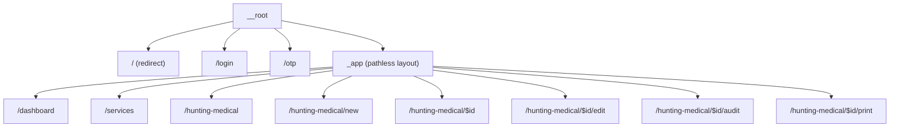

- `_app` is a **pathless layout route** that renders the `Shell` (top bar, sidebar, footer)
  and **guards authentication** in `beforeLoad` (redirect to `/login` when unauthenticated).
- `index.tsx` redirects to `/dashboard` or `/login` based on session presence.
- Route-level guards are mirrored by in-component permission checks.

### 9.3 Component architecture
Two layers under `src/components`:
- **`ui/`** — shadcn/ui primitives (Radix-based), mapped to design tokens.
- **`hms/`** — the product design system and domain components: `Shell`, `Button`, `Card`,
  `Field`, `Modal`, `Toast`, `Badges`, `BloodChips`, `PassFail`, `ReportSection`,
  `ReportForm`, `States`. These are the canonical building blocks; `ReportForm` encapsulates
  the create/edit experience (sticky action bar, progress sidebar, validation).

### 9.4 State & data layer
- No global state library; state is local to routes/components plus a small persistence layer.
- **`src/data/reports.ts`** is the mock store: seed data plus CRUD against `localStorage`
  keys `hms_reports` (and `hms_session` for auth, `hms_pending` for the OTP step).
- **`src/data/lookups.ts`**, `users.ts`, `messages.ts` hold reference data, demo users, and
  the unified system messages (MSG00–MSG18).
- `useCurrentUser` reads the session **client-side** (in `useEffect`) to avoid hydration
  mismatches and to gate UI.

### 9.5 Authentication (client)
Two-step demo flow: `login` validates credentials and stashes a pending user; `otp` verifies
a 4-digit code (`1234`) and establishes the session. This mirrors the backend's
`login` → `verify` token issuance, easing the future switch to real auth.

### 9.6 Authorization (client)
`can(user, action, resource?)` in `src/lib/permissions.ts` hides/disables actions per role and
report state. **This is a UX convenience only**; the server is the source of truth (§11.8).

### 9.7 Internationalization, RTL & theming
- `<html dir="rtl" lang="ar">`; logical CSS utilities (`start/end`, `inset-inline`).
- Numerals/codes/dates are wrapped to render **LTR** via a `.num` utility (tabular figures).
- Design tokens (Carbon-style ramp + SEHA teal brand) live in `styles.css` and are bridged to
  shadcn tokens, so both component layers share one theme.

### 9.8 Printing (UC09)
A dedicated print route renders an A4 sheet; `@media print` hides all app chrome
(`.no-print`), leaving only the report. Triggered by `window.print()`.

### 9.9 Build & delivery
`vite build` → static `dist/`. SPA deep-link fallback is configured in `vercel.json`
(`rewrites` → `/index.html`). Coverage and lint run via `npm test` / `npm run lint`.

---

## 10. Backend Architecture

### 10.1 Style
A pragmatic blend of **vertical slices** (per-feature endpoints) over a small, explicit
**domain layer**. No heavyweight mediator; endpoints orchestrate domain + persistence directly.

### 10.2 Component view (C4 — Level 3)

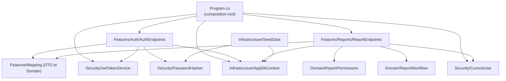

### 10.3 Domain model & invariants
- **Entities:** `Report` (aggregate root) and `User`.
- **Value objects** (owned): `Applicant`, `Vitals`, plus owned collections `Exams` and
  `Timeline`.
- **Invariants** enforced in `ReportWorkflow`: only `Draft`/`Returned` may be submitted; only
  `Submitted`/`UnderReview` may be audited; a return **requires** a note; every transition
  appends a `TimelineEntry`.

### 10.4 Workflow state machine
See §14.2. Implemented in `ReportWorkflow` (`Submit`, `Approve`, `Return`) with guard clauses
throwing `InvalidOperationException`, surfaced as `400 ProblemDetails`.

### 10.5 Persistence
- EF Core 10 + Npgsql. Composite value objects are stored as **`jsonb`** columns via
  `OwnsOne(...).ToJson()` / `OwnsMany(...).ToJson()`, avoiding satellite tables while keeping
  the columns queryable.
- Enums (`Status`, `Result`, `Role`) persist as strings for readability/stability.
- Unique indexes on `User.Username` and `Report.ReferenceNo`.
- **Schema bootstrap:** `EnsureCreatedAsync()` for dev/test simplicity. **Production guidance:**
  switch to EF migrations (`dotnet ef migrations add Initial` + `Database.Migrate()`); this is
  intentionally deferred (see §22).

### 10.6 API design
ASP.NET Core **Minimal APIs**, grouped by feature with `MapGroup`. Reports endpoints require
authorization at the group level; per-action role checks call `ReportPermissions.Can`.

### 10.7 Contracts & mapping
Request/response **DTOs** (`Features/Contracts.cs`) use the frontend's wire vocabulary
(`status` as `draft|submitted|under_review|approved|returned`, `result` as `fit|unfit|null`).
`Mapping.cs` is the single translation point between DTOs and domain entities, isolating the
API surface from internal model changes.

### 10.8 AuthN & AuthZ
- **AuthN:** JWT Bearer. Tokens carry `NameIdentifier`, `name`, `org`, and `role` claims and
  are signed HS256. `CurrentUser` projects claims into a lightweight `User`.
- **AuthZ:** centralized `ReportPermissions.Can(role, action, resource?)` — a role→actions
  matrix plus resource-state rules. Server-side enforcement is authoritative.
- **Passwords:** PBKDF2-SHA256, 100k iterations, per-password salt, constant-time comparison.

### 10.9 Configuration & secrets
`appsettings*.json` + environment overrides. JWT signing key and the DB connection string are
configuration-driven; production must supply a strong key via a secret store (the committed dev
key is a placeholder).

### 10.10 Error handling & validation
Failures return RFC-7807 `ProblemDetails` (`401`, `403`, `400`, `404`). Workflow guard
violations map to `400`. Input shape validation is via binding; richer field validation can be
added with FluentValidation or minimal-API filters (future work).

### 10.11 Observability
- **Elastic APM** is **auto-injected at the image layer** per the pipeline standard; the code
  intentionally contains **no** APM package or configuration.
- `/health` health endpoint; default ASP.NET Core structured logging.

### 10.12 CORS
A permissive default policy is enabled for development; production should restrict origins to
the SPA's domain via configuration.

---

## 11. Data Model

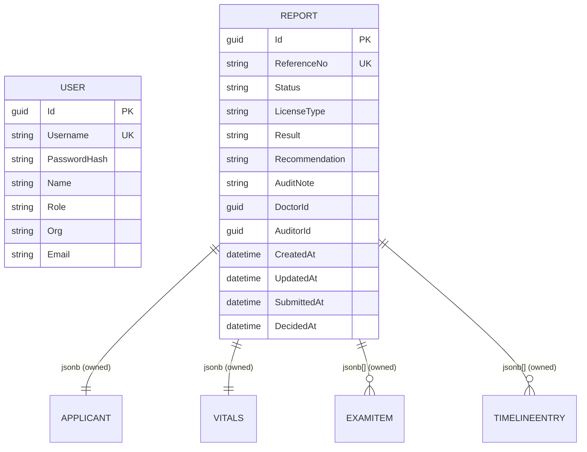

- `Applicant` (name, nationalId, dob, gender, nationality, phone, city, bloodType),
  `Vitals` (height, weight, bloodPressure, pulse), `ExamItem` (key, value, note),
  `TimelineEntry` (at, actorId, actorName, action, note).
- `ReferenceNo` format: `HM-2026-XXXX` (zero-padded sequence).
- The frontend mock model (`src/data/reports.ts`) is intentionally **isomorphic** to the
  backend entity, minimizing integration friction.

---

## 12. API Reference

Base path `/api`. All `reports` endpoints require `Authorization: Bearer <jwt>`.

| Method | Path | Role | Success | Errors |
| --- | --- | --- | --- | --- |
| POST | `/auth/login` | public | 200 (requiresOtp) | 401 |
| POST | `/auth/verify` | public | 200 (token, user) | 401 |
| GET | `/auth/me` | any | 200 (user) | 401 |
| GET | `/reports?status=&q=` | any | 200 (summaries) | 401/403 |
| GET | `/reports/{id}` | any | 200 (report) | 403/404 |
| POST | `/reports` | doctor | 201 (report) | 401/403 |
| PUT | `/reports/{id}` | doctor | 200 (report) | 403/404 |
| POST | `/reports/{id}/submit` | doctor | 200 (report) | 400/403/404 |
| POST | `/reports/{id}/audit` | auditor | 200 (report) | 400/403/404 |

Auth: `bearerAuth` (HTTP bearer, JWT). Errors use `application/problem+json`. The full,
schema-validated contract is in `backend/openapi.yaml` (OpenAPI 3.1) and is also generated at
runtime at `/openapi/v1.json`.

---

## 13. Key Sequence Flows

### 13.1 Authentication

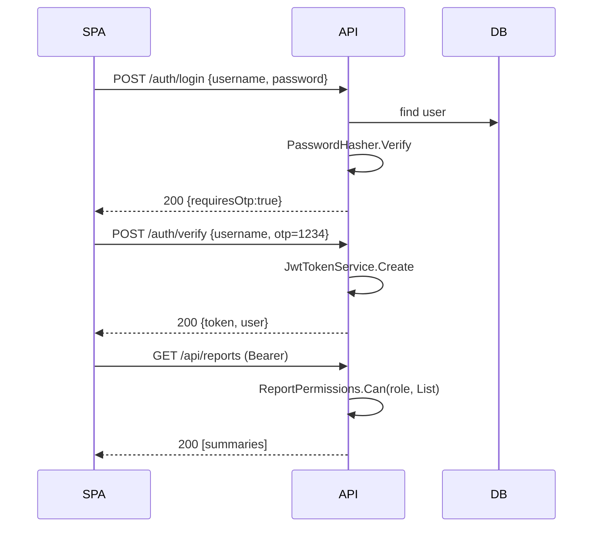

### 13.2 Author → Submit → Audit

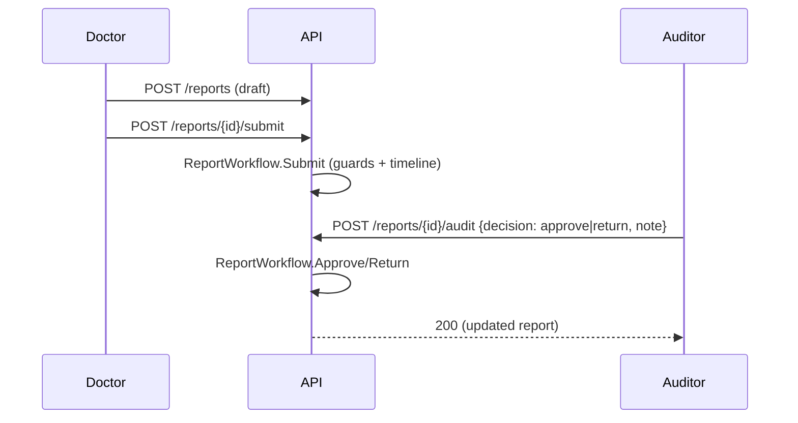

---

## 14. Report Lifecycle

### 14.1 States
`Draft → Submitted → (UnderReview) → Approved | Returned`; `Returned → Submitted` (resubmit);
`Approved → print`.

### 14.2 State machine

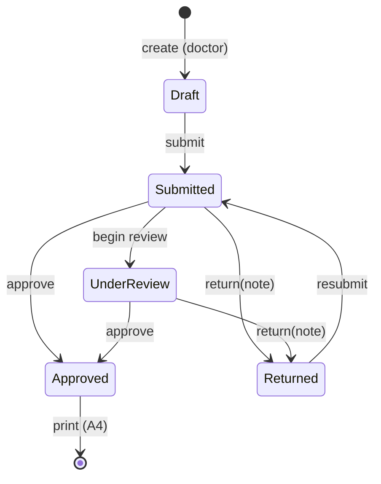

Each transition is recorded in the report's append-only `Timeline`.

---

## 15. Security Architecture

| Control | Implementation | Notes / gaps |
| --- | --- | --- |
| Authentication | JWT Bearer (HS256) | Move to asymmetric keys (RS256) + rotation for prod |
| Authorization | Server-side `ReportPermissions` | Authoritative; client mirror is UX-only |
| Password storage | PBKDF2-SHA256, salted, 100k iters | Consider Argon2id if available |
| Transport | HTTPS (deployment) | Enforce HSTS at the edge |
| Secrets | Config/env | Use a secret manager in prod; dev key is a placeholder |
| Token replay | Short-lived JWT (120 min) | Add refresh tokens / revocation list if needed |
| OTP | Demo `1234` | Replace with a real OTP provider |
| CORS | Permissive (dev) | Restrict to SPA origin in prod |
| Audit trail | Per-report `Timeline` | Immutable by convention; enforce at DB if required |

Threats considered: privilege escalation (mitigated by server-side RBAC + resource-state
checks), tampering (HTTPS + signed tokens), repudiation (timeline/action log).

---

## 16. Testing Strategy

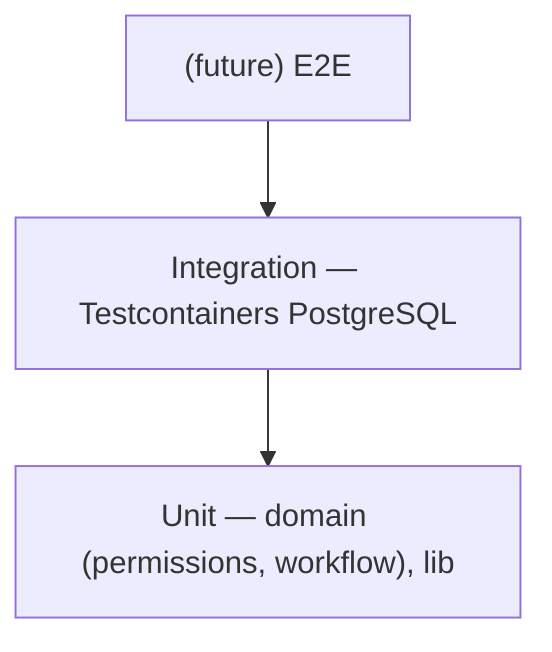

- **Frontend (Vitest):** unit tests for `permissions`, `format`, `session`, `reports`,
  `lookups`, `messages`, `users` (jsdom + localStorage). Coverage scoped to `src/lib` and
  `src/data` with a 20% gate, comfortably exceeded.
- **Backend (xUnit):**
  - *Unit:* `ReportPermissions` (RBAC matrix + resource rules) and `ReportWorkflow`
    (transitions, guard clauses).
  - *Integration:* `ApiFactory` boots the API via `WebApplicationFactory<Program>` and a real
    **ephemeral PostgreSQL via Testcontainers**, exercising the auth flow and reports endpoints
    (no mocks for infrastructure, per the standard). Coverage gate ≥20% via Coverlet
    (`coverlet.runsettings`).
- **Coverage schedule:** 20% (Feb) → 40% (Mar) → 60% (Apr); raised by adding component/form
  tests (FE) and more endpoint/edge tests (BE).

---

## 17. Build Pipeline & Standards Compliance

> **Verification note:** The authoring environment has **no .NET SDK** and **package
> registries are blocked** (npm/nuget → 403), so `dotnet build/test`, `npm test`, and
> `npm run lint` **could not be executed here**. Items below marked **⏳ PENDING** are
> implemented in code/config but **not yet built/tested**; run them in an environment with
> .NET 10 SDK + Docker + registry access (Codespaces/CI). What *was* executed here: a Python
> structural validation of `openapi.yaml` and an Elastic-APM `grep`.

| Mandate | Status | Compliance |
| --- | --- | --- |
| OpenAPI validation | ✅ impl · partial check | `openapi.yaml` 1.1.0 hardened; **0 Critical / 0 High** on the Python-checked subset. Official 55-rule tool (Spectral/Coderz): ⏳ PENDING |
| Elastic APM auto-inject | ✅ **verified** | `grep` confirms no APM package/config anywhere |
| .NET 10 (`net10.yaml`) | ✅ impl · ⏳ build | `net10.0` TFM; `backend/pipeline/net10.yaml` |
| Node 22 / end of Node 20 | ✅ impl | `engines.node >= 22`, `.nvmrc` |
| Coverage ≥20% (FE) | ⏳ PENDING | Scope widened to whole project; real % needs a run (likely <20% until UI tests added) |
| Coverage ≥20% (BE) | ⏳ PENDING | Coverlet over full assembly; needs `dotnet test` |
| Testcontainers | ✅ impl · ⏳ run | PostgreSQL integration tests |
| Database standards | ⚠️ **unconfirmed assumption** | PostgreSQL chosen; standard doc encrypted — needs human confirmation (see §22 R3) |
| Elastic APM residue | ✅ verified | none |

Full, deviation-by-deviation mapping in `STANDARDS.md` (incl. the `x-languages`, EF-Migrations,
and React-PascalCase documented deviations).

---

## 18. Deployment Architecture

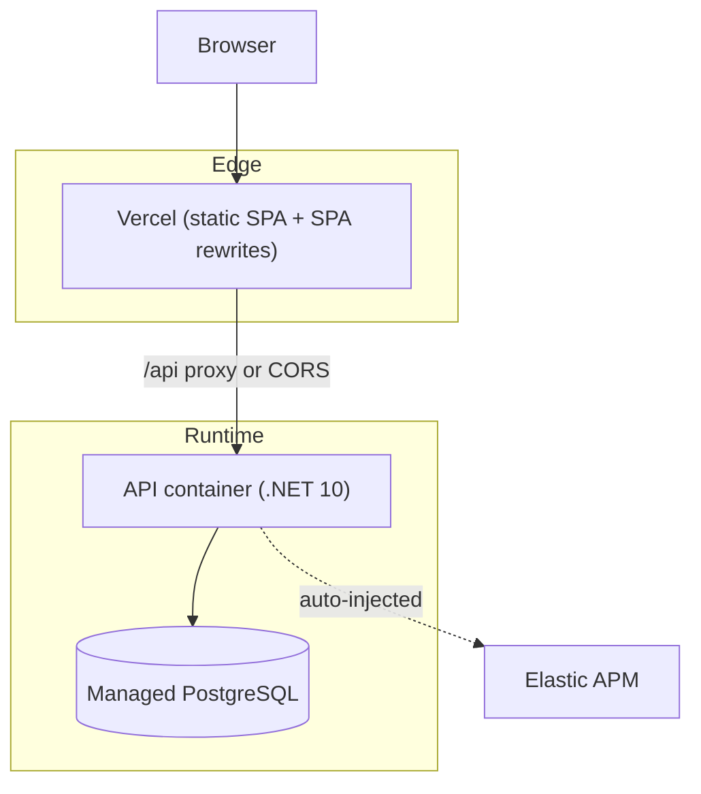

| Component | Environment | Mechanism |
| --- | --- | --- |
| SPA | Vercel | `vite build` → `dist`; `vercel.json` rewrites |
| API | Container/host | `dotnet publish`; horizontally scalable, stateless |
| DB | Managed PostgreSQL | Migrations on deploy (recommended) |
| Local dev | Docker | `backend/docker-compose.yml` for PostgreSQL |

Environments: Development (local Docker), CI (Testcontainers), Production (managed DB + secret
store). The API is stateless, enabling multiple replicas behind a load balancer.

---

## 19. Frontend–Backend Integration Plan

The frontend is currently decoupled (localStorage). Target integration:

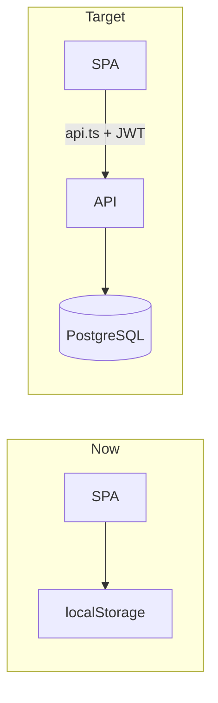

Steps:
1. Add `src/lib/api.ts` (typed fetch wrapper) reading `VITE_API_URL`, attaching the Bearer token.
2. Persist the JWT (e.g., `localStorage` `hms_token`) on `verify`; send on every request.
3. Replace `src/data/reports.ts` and `src/lib/session.ts` call sites with API calls
   (the DTOs already match the client model).
4. Restrict API CORS to the SPA origin; configure the production `VITE_API_URL`.
5. Add a thin error→toast mapping reusing the existing `messages` catalog.

Because the wire contracts are isomorphic to the client model, this is a localized change at the
data-access seams, not a UI rewrite.

---

## 20. Cross-Cutting Concerns (Summary)

| Concern | Where |
| --- | --- |
| AuthN/Z | `Security/*`, `Domain/ReportPermissions`, FE `lib/permissions.ts` |
| Validation | API binding (BE), `ReportForm` rules (FE) |
| Error handling | `ProblemDetails` (BE), `Toast`/messages (FE) |
| Observability | Auto-injected APM, `/health`, structured logs |
| Configuration | `appsettings*.json` + env (BE), `VITE_*` (FE) |
| i18n / RTL | `styles.css`, logical utilities, `.num` |
| Audit | `Report.Timeline` |

---

## 21. Architecture Decision Records (ADRs)

**ADR-001 — Static SPA (no SSR) for the frontend.**
*Context:* No server-side rendering needs; the app is client-only with local persistence.
*Decision:* Ship a static SPA (Vite) with SPA-fallback routing.
*Consequences:* Simplest/cheapest hosting; SEO not a concern; deep links handled via rewrites.

**ADR-002 — .NET 10 for the backend.**
*Context:* Enterprise pipeline mandates `net10.yaml` (new LTS); environment is .NET-centric.
*Decision:* ASP.NET Core .NET 10 Minimal APIs.
*Consequences:* Pipeline-aligned; modern minimal-API ergonomics.

**ADR-003 — PostgreSQL.**
*Context:* DB standards doc was encrypted/unreadable; need Testcontainers support.
*Decision:* PostgreSQL via EF Core/Npgsql.
*Consequences:* Strong test story; **risk** if the standard mandates another engine (revisit).

**ADR-004 — JSON/`jsonb` for composite value objects.**
*Context:* Applicant/Vitals/Exams/Timeline are report-owned and rarely queried independently.
*Decision:* Persist as owned `jsonb` via EF `ToJson()`.
*Consequences:* Fewer tables, simpler aggregate; cross-row querying of nested fields is limited.

**ADR-005 — Duplicate permission logic on client and server.**
*Context:* Need responsive UX and authoritative enforcement.
*Decision:* Mirror `can()` (FE) and `ReportPermissions` (BE).
*Consequences:* Slight duplication; server remains source of truth. Consider generating one
from the other later.

**ADR-006 — `EnsureCreated` now, migrations later.**
*Context:* Authoring environment lacks SDK/DB; migrations need design-time tooling.
*Decision:* `EnsureCreated` for dev/test; document migration path for prod.
*Consequences:* Fast start; **must** add migrations before production (tech debt).

---

## 22. Risks, Limitations & Technical Debt

| # | Item | Impact | Mitigation |
| --- | --- | --- | --- |
| R1 | Backend/frontend **not built or tested** in authoring env (no SDK, blocked registries) | Compliance unverified | Run `dotnet build/test`, `npm test`, `npm run lint` in CI/Codespaces (⏳ PENDING) |
| R2 | Package versions pinned to plausible 10.x | Restore failures | Align to feed's latest 10.x |
| R3 | **Database standard unread (encrypted)** — PostgreSQL is an unconfirmed assumption | Possible engine/standard mismatch; affects `jsonb`, Testcontainers image, Npgsql | **Human confirmation required before any migration**; engine unchanged; impact list in `STANDARDS.md §3`; revisit ADR-003 |
| R4 | OpenAPI checked only with a Python subset, not the official 55-rule tool | Hidden Critical/High possible | Run Spectral/Coderz validator on `openapi.yaml` (⏳ PENDING) |
| R5 | Coverage scope widened to whole project; real % unmeasured and likely <20% | Coverage gate may fail | Add UI/component + endpoint tests; measure real % (⏳ PENDING) |
| R6 | Frontend not wired to API; permission logic mirrored in two places | Drift risk | `shared/permissions.json` is now the SoT; auto-generate both sides in CI; execute §19 |
| R7 | `EnsureCreated` instead of EF Migrations | Prod schema management | Add EF migrations (needs SDK — deferred); EF Migrations documented as the approved Liquibase/Flyway alternative |
| R8 | Audit `Timeline` immutable by convention only | Tamperable in DB | Add DB triggers blocking UPDATE/DELETE in the first migration (deferred) |
| R9 | Demo OTP/credentials, HS256, **permissive CORS** | Not production-secure | Real OTP, RS256+rotation, **mandatory** origin-scoped CORS in prod, secret store |
| R10 | No request-validation framework (422 surfaced in OpenAPI, not yet enforced) | Weak input guarantees | Add FluentValidation / endpoint filters |

---

## 23. Future Work / Roadmap

- Wire SPA → API (§19); remove localStorage data path.
- EF migrations + seed separation; production-grade auth (Nafath, RS256, refresh tokens).
- Raise coverage to 40%→60% with component/form and endpoint/edge tests.
- Add request validation, rate limiting, pagination metadata, and idempotency on writes.
- Real integration with Ministry of Environment registry; notifications; attachments.
- E2E tests (Playwright) for critical journeys.

---

## 24. Glossary

| Term | Meaning |
| --- | --- |
| HMS | Hunting Medical (reports) System |
| UC01–UC09 | Use cases: list, create, draft, audit, view, edit, print |
| Owned type | EF value object persisted within its aggregate (here, as `jsonb`) |
| Timeline | Per-report append-only action log |
| RBAC | Role-based access control |
| Testcontainers | Library that runs ephemeral Docker dependencies for tests |

---

## 25. Appendix — Component Inventory

- **Frontend domain components:** `Shell`/`PageHeader`, `ReportForm`, `Badges`
  (`StatusBadge`, `ResultBadge`), `BloodChips`, `PassFail`, `ReportSection`, `Field`
  (`TextInput`, `Select`, `TextArea`), `Modal`, `Toast`, `States`.
- **Backend modules:** `Domain` (`Enums`, `Report`, `User`, `ReportPermissions`,
  `ReportWorkflow`), `Infrastructure` (`AppDbContext`, `SeedData`), `Features` (`Contracts`,
  `Mapping`, `Auth/AuthEndpoints`, `Reports/ReportEndpoints`), `Security` (`JwtOptions`,
  `JwtTokenService`, `CurrentUser`, `PasswordHasher`), `Program`.
- **Tests:** FE — 7 spec files (lib + data). BE — `ReportPermissionsTests`,
  `ReportWorkflowTests`, `ApiFactory`, `ReportsApiTests`.
