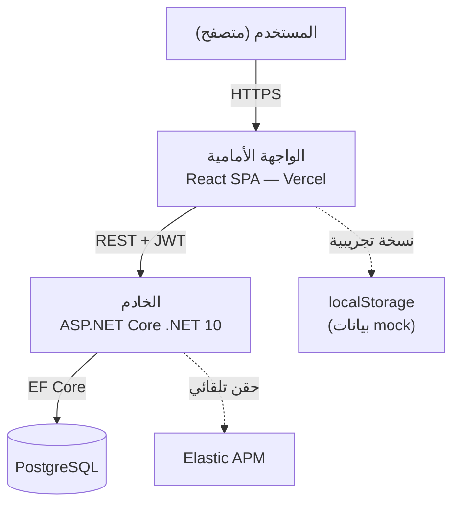
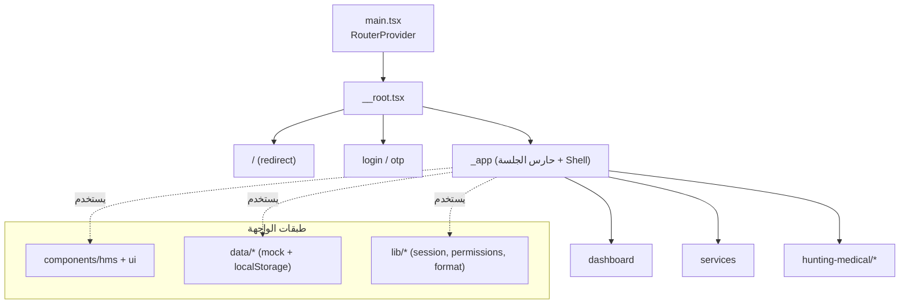
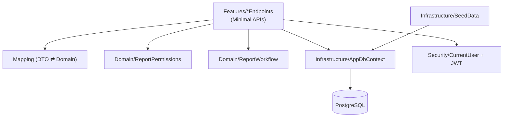
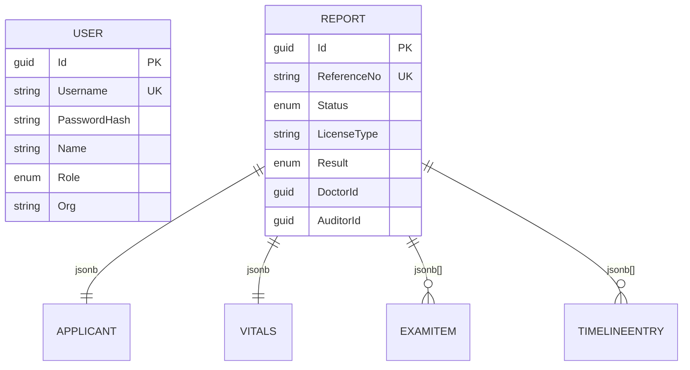
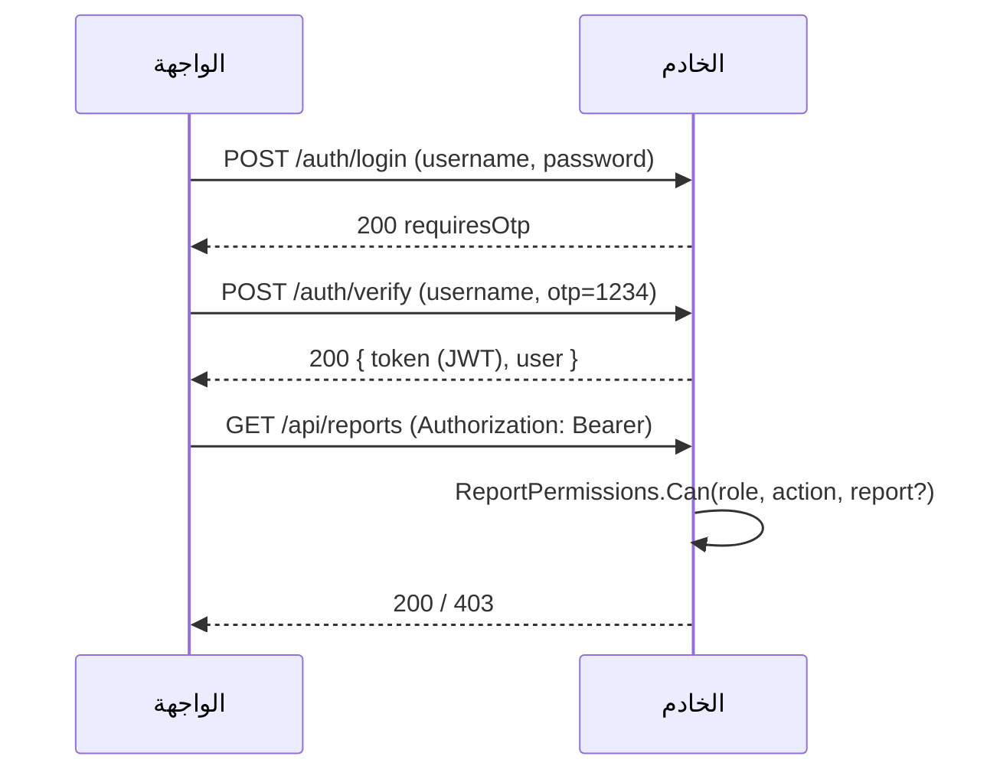
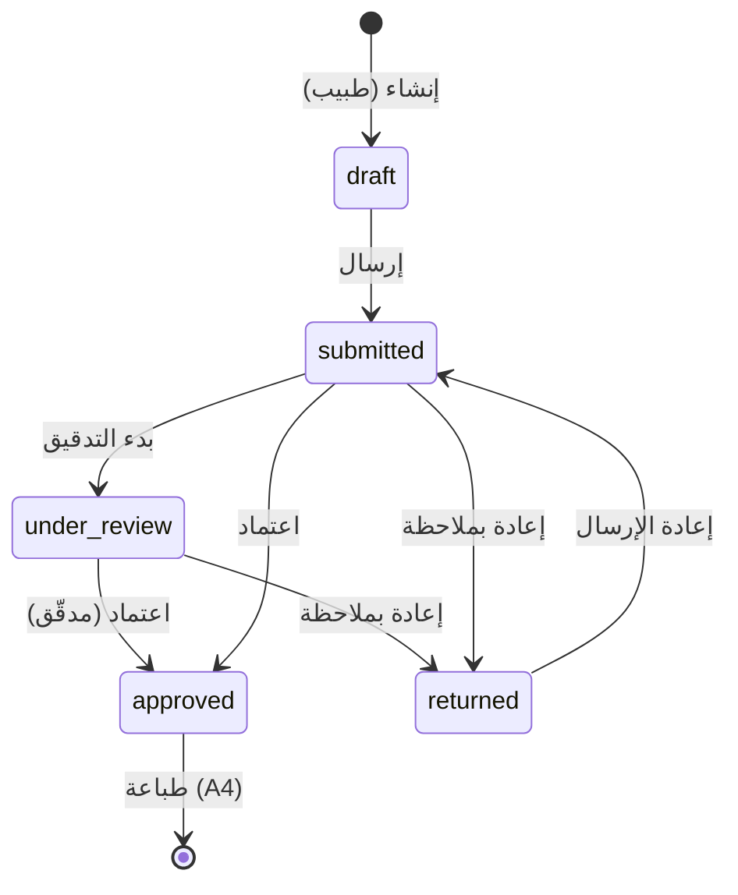
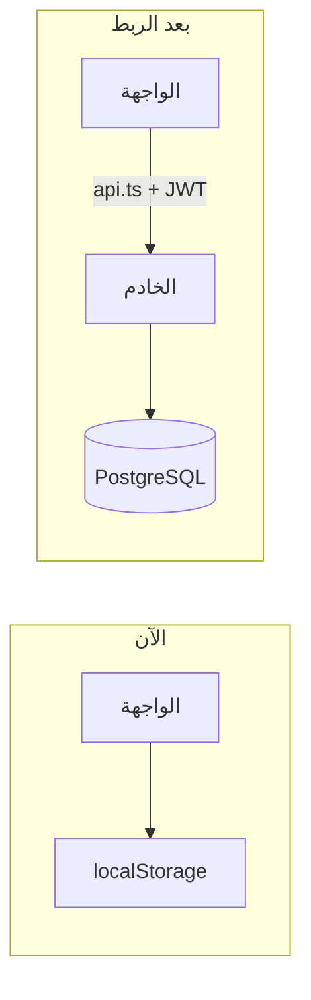

# معمارية المشروع — نظام التقارير الطبية لرخص الصيد (منصة صحة)

> وثيقة معمارية شاملة تشرح المشروع من الأعلى للأسفل: نظرة عامة، المكوّنات،
> التقنيات، نموذج البيانات، تدفّقات العمل، الأمان، النشر، والاختبارات.

---

## 1. نظرة عامة

نظام لإصدار وتدقيق وطباعة **التقارير الطبية لرخص الصيد** عبر منصة صحة. يتكوّن من:

- **واجهة أمامية (Frontend):** تطبيق صفحة واحدة (SPA) بـ React + TanStack Router،
  بهوية بصرية بنمط Carbon ودعم كامل لـ RTL والعربية.
- **خادم خلفي (Backend):** واجهة برمجية REST بـ ASP.NET Core (.NET 10) مع
  PostgreSQL، مصادقة JWT، وتوثيق OpenAPI.

الأدوار الثلاثة: **طبيب فحص** (إنشاء/تعديل/إرسال) · **مدقّق طبي** (اعتماد/إعادة) ·
**مدير** (قراءة).



> **ملاحظة الحالة:** الواجهة حاليًا تعمل ببيانات mock في `localStorage`. الخادم
> جاهز ومبنيّ، والخطوة التالية هي ربط الواجهة بالـ API (موثّقة في القسم 9).

---

## 2. حزمة التقنيات

| الطبقة | التقنية |
| --- | --- |
| الواجهة | React 19، TypeScript، TanStack Router، Tailwind v4، Vite |
| اختبارات الواجهة | Vitest + تغطية v8 |
| الخادم | ASP.NET Core (.NET 10)، Minimal APIs |
| الوصول للبيانات | EF Core + Npgsql (PostgreSQL، أعمدة jsonb) |
| المصادقة | JWT (Bearer) + PBKDF2 لكلمات المرور |
| التوثيق | OpenAPI 3.1 (توليد مدمج + `openapi.yaml`) |
| اختبارات الخادم | xUnit + Coverlet + Testcontainers (PostgreSQL) |
| النشر | Vercel (الواجهة) · حاوية/خادم .NET (الخادم) |

---

## 3. هيكل المستودع

```text
.
├── src/                         # الواجهة الأمامية (React SPA)
│   ├── routes/                  # مسارات TanStack (file-based)
│   │   ├── __root.tsx           # الجذر (Outlet + Toaster)
│   │   ├── index.tsx            # إعادة توجيه
│   │   ├── login.tsx, otp.tsx   # المصادقة
│   │   └── _app/                # تخطيط محمي (Shell) + الصفحات
│   │       ├── dashboard.tsx, services.tsx
│   │       └── hunting-medical/ # UC01..UC09
│   ├── components/
│   │   ├── hms/                 # مكوّنات النظام (Shell, Button, ReportForm…)
│   │   └── ui/                  # مكوّنات shadcn/ui
│   ├── data/                    # نماذج + mock (reports, users, lookups, messages)
│   ├── lib/                     # أدوات (session, permissions, format, utils)
│   ├── hooks/                   # useCurrentUser
│   └── styles.css               # Design tokens (Carbon) + RTL + طباعة
│
├── backend/                     # الخادم (.NET 10)
│   ├── src/Seha.HuntingMedical.Api/
│   │   ├── Domain/              # الكيانات + الصلاحيات + سير العمل
│   │   ├── Infrastructure/      # DbContext + SeedData
│   │   ├── Features/            # العقود + التحويل + نقاط النهاية
│   │   ├── Security/            # JWT + تجزئة كلمات المرور + المستخدم الحالي
│   │   └── Program.cs           # تركيب التطبيق
│   ├── tests/                   # وحدة + تكامل (Testcontainers)
│   ├── openapi.yaml             # تعريف الـ API
│   └── pipeline/net10.yaml      # مرجع خط البناء
│
├── ARCHITECTURE.md  STANDARDS.md  README.md
└── vercel.json  vitest.config.ts  vite.config.ts
```

---

## 4. معمارية الواجهة الأمامية

تطبيق **SPA** — لا SSR (مناسب لأن المنطق كله من جهة العميل حاليًا).



**مبادئ:**
- **الراوتر:** ملفّي (file-based)؛ `_app` مسار بلا مسار (pathless) يلفّ الصفحات
  المحمية بـ `Shell` ويحرس الجلسة في `beforeLoad`.
- **الصلاحيات في الواجهة:** `can(user, action, resource)` تُخفي/تعطّل الأزرار.
- **الحالة:** محلية لكل صفحة + `localStorage` كمخزن (`hms_session`, `hms_reports`).
- **RTL:** `dir="rtl"` على `<html>`، أدوات منطقية (`start/end`)، و`.num` لعرض
  الأرقام LTR.
- **الطباعة (UC09):** صفحة A4 مستقلة عبر `window.print()` و`@media print`.

---

## 5. معمارية الخادم

تقسيم بأسلوب **Vertical Slices + Domain** خفيف:



**الطبقات:**
- **Domain:** كيانات (`Report`, `User`) + منطق نقي (`ReportPermissions`,
  `ReportWorkflow`) — قابل للاختبار بالكامل بلا تبعيات.
- **Infrastructure:** `AppDbContext` (EF Core) + البذرة. القيم المركّبة (المتقدّم،
  العلامات الحيوية، الفحوص، سجل الإجراءات) تُخزّن كـ **jsonb** عبر
  `OwnsOne/OwnsMany().ToJson()`.
- **Features:** عقود (DTOs) + `Mapping` + نقاط النهاية (Minimal APIs).
- **Security:** إصدار/تحقق JWT، `ICurrentUser` من المطالبات، `PasswordHasher`
  (PBKDF2-SHA256).

**نقاط النهاية:**

| الطريقة | المسار | الدور |
| --- | --- | --- |
| POST | `/api/auth/login` · `/api/auth/verify` | عام |
| GET | `/api/auth/me` | الجميع (مصادق) |
| GET | `/api/reports` · `/api/reports/{id}` | الجميع |
| POST/PUT | `/api/reports` · `/api/reports/{id}` | طبيب |
| POST | `/api/reports/{id}/submit` | طبيب |
| POST | `/api/reports/{id}/audit` | مدقّق |

---

## 6. نموذج البيانات



- المفاتيح: `User.Username` و`Report.ReferenceNo` فريدة.
- `Status`/`Result`/`Role` تُخزّن كنصوص (محوّلة عبر EF).
- نفس النموذج يتطابق مع كيانات الواجهة (`src/data/reports.ts`) لتسهيل الربط.

---

## 7. المصادقة والصلاحيات



- **مصفوفة الصلاحيات** متطابقة في الطرفين (الواجهة `can()` والخادم
  `ReportPermissions.Can()`): الواجهة لتجربة المستخدم، والخادم كمصدر الحقيقة.
- قواعد على مستوى المورد: التعديل/الإرسال على (مسودة|مُعاد) للطبيب فقط، التدقيق
  على (مُرسل|قيد التدقيق) للمدقّق فقط.

---

## 8. دورة حياة التقرير



كل انتقال يسجّل مدخلًا في **سجل الإجراءات (Timeline)** عبر `ReportWorkflow`.

---

## 9. الربط بين الواجهة والخادم (الخطوة التالية)

حاليًا الواجهة تقرأ/تكتب من `localStorage`. للربط الحقيقي:

1. إضافة عميل HTTP (`src/lib/api.ts`) يحمل `Authorization: Bearer` ويقرأ
   `VITE_API_URL`.
2. استبدال نداءات `src/data/reports.ts` و`session` بنداءات الـ API.
3. تخزين الـ JWT في `localStorage`، وتمريره في كل طلب.
4. ضبط CORS في الخادم (مفعّل افتراضيًا للتطوير).



---

## 10. النشر

| المكوّن | البيئة | كيف |
| --- | --- | --- |
| الواجهة | Vercel | `vite build` → `dist` + إعادة توجيه SPA (`vercel.json`) |
| الخادم | حاوية/خادم .NET | `dotnet publish` + PostgreSQL مُدار |
| قاعدة البيانات | PostgreSQL | `docker-compose.yml` للتطوير |

---

## 11. الاختبارات والالتزام بالمعايير

| المعيار | الواجهة | الخادم |
| --- | --- | --- |
| إطار الاختبار | Vitest | xUnit |
| التغطية | v8 (≥20%) | Coverlet (≥20%) |
| التكامل | — | Testcontainers (PostgreSQL) |
| الأمر | `npm test` | `dotnet test` |

تفاصيل كاملة في [`STANDARDS.md`](./STANDARDS.md). البنية صُمّمت لتكون **قابلة
للاختبار**: المنطق النقي معزول في `src/lib` و`backend/.../Domain`.

---

## 12. قرارات معمارية موجزة (ADR)

| القرار | السبب |
| --- | --- |
| SPA بدل SSR للواجهة | لا منطق خادمي في الواجهة؛ نشر ثابت أبسط وأرخص |
| .NET 10 للخادم | يطابق قالب المؤسسة `net10.yaml` (أحدث LTS) |
| PostgreSQL | دعم ممتاز لـ Testcontainers (وثيقة معايير الـ DB مشفّرة — افتراض) |
| jsonb للقيم المركّبة | تبسيط النموذج وتقليل الجداول مع الحفاظ على الاستعلام |
| تكرار منطق الصلاحيات | الواجهة لتجربة المستخدم، الخادم كمصدر الحقيقة الأمني |
